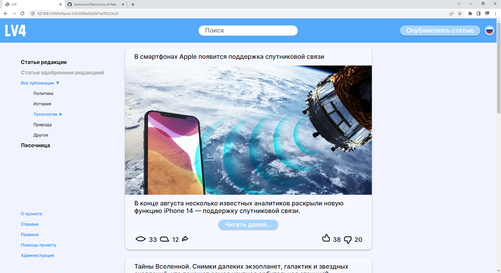

   

# Levach

   

This is a very early version of the website, everything is prone to chnage.

## Setup

Use the latest version of Python. Flask supports Python 3.7 and newer

1. `git clone https://github.com/marxunion/Democritus`
2. `cd Democritus`
3. `git switch flask`
4. - win `py -3 -m venv venv`
   - linux `python3 -m venv venv`
5. - win `venv\Scripts\activate.bat`
   - linux `source venv/bin/activate`
6. `pip install Flask pymongo python-dotenv`
7. copy `.env.example` into `.env` and change it according to your setup

To setup the `systemd` service:

1. Open `lv4.service` and modify it according to your username and system path
2. `sudo ln lv4.service /etc/systemd/system/lv4.service`
3. `sudo systemctl enable lv4`

## Run

- `./service.sh`

or

- `flask --debug run` only when in venv already

or

- `sudo systemctl start lv4`
- `journalctl -f -u lv4` to view the libe log
- `sudo systemctl stop lv4` to stop the service

## References

- Design reference in Figma - https://www.figma.com/file/9B9S8C2aSLCABUiTP9t5yl/Untitled?node-id=0%3A1
- Flask - https://flask.palletsprojects.com/en/2.2.x/
