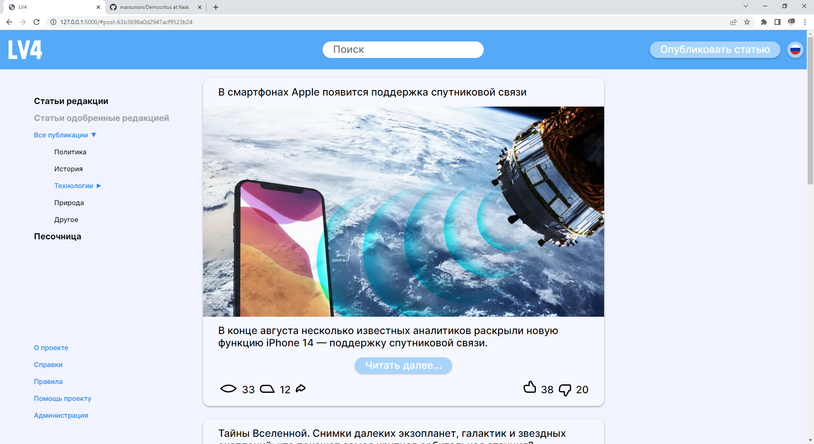

   

# Levach

   

This is a very early version of the website, everything is prone to chnage.

## Setup

Use the latest LTS version of Node.js (18) and Postgress 15.

1. `git clone https://github.com/ValentineStone/lv4`
2. `cd lv4`
3. `npm i`
7. copy `.env.example` into `.env.local` and change it according to your setup

To setup the `systemd` service:

1. Open `lv4.service` and modify it according to your username and system path
2. `sudo ln lv4.service /etc/systemd/system/lv4.service`
3. `sudo systemctl enable lv4`

## Run

- `./service.sh`

or

- `npm run dev`

or

- `sudo systemctl start lv4`
- `journalctl -f -u lv4` to view the live log
- `sudo systemctl stop lv4` to stop the service

## Extras

- `sudo iptables -t nat -A PREROUTING -p tcp --dport 80 -j REDIRECT --to-port 8080`
- `sudo iptables -t nat -I OUTPUT -p tcp -d 127.0.0.1 --dport 80 -j REDIRECT --to-ports 8080`

## References

- Design reference in Figma - https://www.figma.com/file/9B9S8C2aSLCABUiTP9t5yl/Untitled?node-id=0%3A1
- Next 13 App Router (beta) docs - https://beta.nextjs.org/docs
